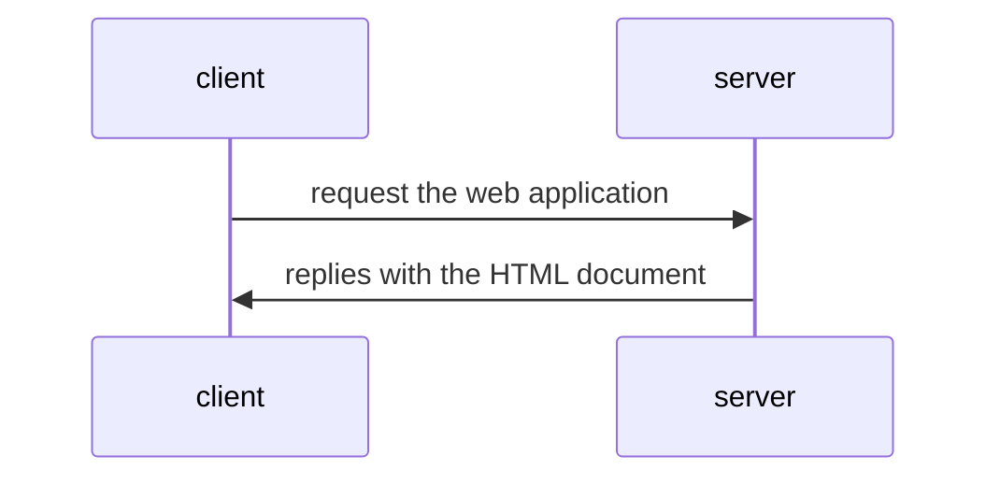

# fullstackopen-part0-exercises

## Exercise 0.4

```mermaid
sequenceDiagram
    participant client
    participant server
    client->>server: request the web application
    server->>client: replies with the HTML document
```
