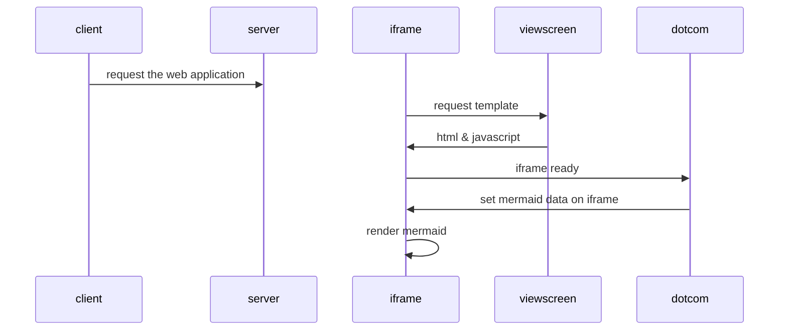

# fullstackopen-part0-exercises

```mermaid
sequenceDiagram
    participant client
    participant server
    client->>server: request the web application
    iframe->>viewscreen: request template
    viewscreen->>iframe: html & javascript
    iframe->>dotcom: iframe ready
    dotcom->>iframe: set mermaid data on iframe
    iframe->>iframe: render mermaid
```
