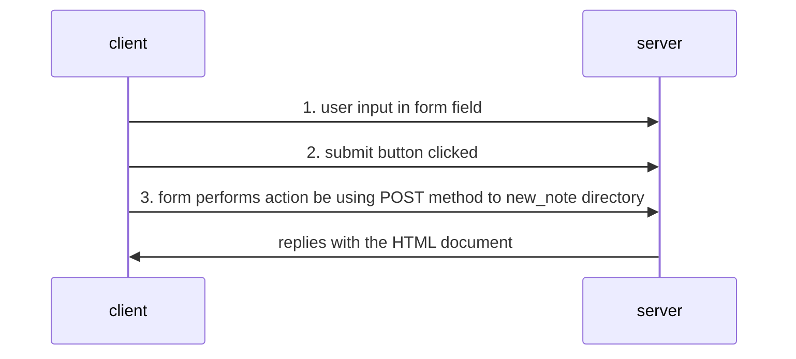

# fullstackopen-part0-exercises

## Exercise 0.4
The user creates a new note on the page https://studies.cs.helsinki.fi/exampleapp/notes by writing something into the text field and clicking the submit button.

The sequence of events that occurs is depicted below.

